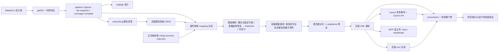

# mastergo-wpf-transcoder 项目架构

> 本文只讲**架构与关键组成**，不逐文件罗列、也不复制任何规则正文。字段级规则看 `skills/mastergo-to-wpf/references/`，流程与硬规则看 `skills/mastergo-to-wpf/SKILL.md`（唯一流程路由），团队/设计师阅读副本见 §5 规则与文档分层。

## 1. 插件是什么

把明确指定的 MasterGo 设计稿转换成能通过目标项目硬门禁的 **MTSLG IOContorl 页面**：页面 XML、页面 Icon（XAML Geometry）、多语言字典、Layout 注册、mapping/provenance 审计，以及目标项目要求的 WPF 宿主壳（View / code-behind / ViewModel）与构建登记。

插件内保留两条路线：

| 路线 | Adapter | 状态 | 说明 |
|---|---|---|---|
| **作业 B** | `mtslg-iocontrol` | **当前唯一启用** | 完整页面交付链路；本架构文档的主体 |
| 作业 A | `mw-wpf` | 资料保留、暂不开放 | 重新启用前必须完成全篇复核（含本页 Icon 字典的合并点） |

## 2. 顶层结构

```text
plugins/mastergo-wpf-transcoder/
├─ .claude-plugin/plugin.json      # 插件清单（名称、版本号）
├─ README.md                       # 安装、能力概览、本地验证入口
├─ ARCHITECTURE.md                 # 本文
├─ skills/
│  ├─ mastergo-to-wpf/             # 主 Skill：流程路由 + 参考文档 + 全部脚本
│  │  ├─ SKILL.md                  # 唯一流程路由与硬规则总表
│  │  ├─ references/               # 规则事实源（适配器文档、映射表、框架手册）
│  │  └─ scripts/                  # 交付链路脚本（运行时）
│  │     ├─ lib/                    # 跨脚本共享实现（唯一副本，禁止再抄进脚本）
│  │     └─ tests/                 # 开发期回归测试（CI 不跑，本地跑）
│  └─ mastergo-iocontrol-document-format/   # 映射文档写作规范 Skill
```

## 3. 交付链路（数据流）



本图只表达**数据流与责任边界**；每一步的规则文本、门禁条件与字段口径以 `SKILL.md` 与 `references/` 为准，本文不复制。

## 4. 关键脚本（按阶段）

| 阶段 | 关键脚本 | 职责 |
|---|---|---|
| 采集 | `call-mastergo-mcp.js`、`mastergo-dsl-pipeline.ps1` | 调 MCP、落盘快照、校验根/父子链/唯一 ref、产出覆盖报告 |
| 事实提取 | `resolve-mastergo-visibility.js` | 机械输出可见性与 TEXT/PATH 索引，不判控件类型 |
| 图标 | `discover-mtslg-page-icon-map.js`、`gen-mtslg-page-icons.js` | 发现候选、生成页面 Icon（XAML Geometry） |
| 映射 | `gen-mtslg-mapping-from-dsl.js`、`resolve-mtslg-template-mapping.js` | 从 DSL 建立 mapping、按模板解析槽位与固定字段；表格族（`tableTemplates`）按「结构签名（GROUP + 表头群组 + item 行群组 + 表头可见文本，图层名不参与匹配）」发射 DataGrid 根节点与列定义子节点，行数据只登记进 `mapping.tableAudits[].rows` 不发射控件，`tableAudits[].valuePending` 标记待绑定的数据源 |
| 容器嵌套 | `apply-container-containment.js` | **Bundle 默认自动调用**（在模板解析之后、语言键派生之前）：把命中 `childPolicy=nested-page-templates` 的容器按「坐标完全包含」重挂子控件、改写 `parent`/`layoutParent` 并重算 `expectedLeft/expectedTop`；报告 `Generated/<页面名>.nesting-report.json`；`manifest.nesting.enabled=false` 可关闭 |
| Layout | `gen-mtslg-layout-manifest.js`、`gen-mtslg-layout.js` | 机械推导 `menuItems` 清单、发射/增量更新 Layout.xml |
| 页面发射 | `gen-iocontrol-xml.js` | 发射页面 IOContorl XML（fresh / merge） |
| 多语言 | `gen-mtslg-lang-keys-from-dsl.js`、`gen-mtslg-page-lang.js` | 派生语言键、发射 CN/EN 字典 |
| 宿主 | `gen-mw-wpf-page.js` | 生成 View / code-behind / ViewModel 与 csproj 登记 |
| 编排 | **`gen-mastergo-page-bundle.js`（主入口）** | 串起模板解析 → 容器嵌套重挂 → 语言键 → LangName → XML → 校验 → Icon → Layout → 宿主 → 最终校验 |
| 编排（外层一键） | `run-all.ps1`、`build-icon-ledger.mjs`、`build-bundle-manifest.mjs` | 把「取数 → 快照 → extractSvg → 显隐 → mapping → 图标候选 → 台账 → Layout 清单 → Bundle 清单 → bundle → 门禁 → 验证」12 步串成一条命令；支持 `-Progress` / `-StopAfter` 断点续跑、每步落日志；`build-icon-ledger.mjs` 按页面自己的命名表生成台账，`build-bundle-manifest.mjs` 由 Layout 清单 + `.csproj` 推导 Bundle 清单 |
| 门禁 | `validate-iocontrol-provenance.js`、`check-iocontrol-coords.js` | 来源闭环、必写字段、坐标 0 MISMATCH / 0 EXTRA；表格列定义按 `tableTemplates.columnTemplate` 的固定几何与字段集单独校验（不套 `controlTypeRequiredAttrs`） |
| 门禁（交付前后核对） | `run-verifications.ps1`、`verify-page.ps1`、`verify-icon-source.mjs`、`check-coords.mjs` | 四项独立验证（provenance / 坐标 / Icon 坐标 / 结构闭环）并落日志；结构闭环按**本页** `<Page>` 子树校验（Layout 是项目级共享文件）；图标几何来源核对（`sourceId` 指向页面根 / 被多条条目共用 / 缺 extractSvg 条目 → 必须 `fromDsl`）由 `run-all.ps1` 的 **ledger 步（第 7 步）自动调用**（`--naming` 只核对本页登记的条目）；坐标核对输入按映射重算 |
| 审计/运维 | `audit-mtslg-feishu-map.js`、`classify-mastergo-groups.js`、`scan-mtslg-keys.ps1`、`sync-to-mt.ps1`、`cap-window.ps1` | 文档覆盖审计、组件分类、键查证、运行目录同步、视觉截图（`cap-window.ps1 -Method printwindow\|screen`） |
| 脚本复用门禁 | `audit-script-duplication.js`（由 `tests/script-duplication.test.js` 调用） | 禁止「同一个功能写两份」：复制体（函数体完全相同）直接失败；同名函数必须在 `lib/script-reuse-registry.json` 登记原因 |

### 4.1 脚本函数复用（`scripts/lib/` 与硬门禁）

脚本各自可独立运行，历史上因此把同一套工具函数抄了多份，抄完就开始漂移（`inferHostPaths` 两处一份用 `startsWith`、一份用 `includes`；`num` 一处 `parseFloat`、一处 `Number`）。现在的口径是**同一个功能只允许一份实现**：

| 共享模块 | 内容 | 使用方 |
|---|---|---|
| `lib/script-helpers.js` | `fail` / `failWithPrefix` / `failAndExit`、`normalizeNewlines`、`langValueText`、`decodeXmlEntities`、`normalizeForCompare`、`xmlAttr`、`xmlDocText`、`xmlElementText`、`normalizeToken`、`numberOrNull`、`readJson`、`backupFile` | 全部脚本 |
| `lib/project-csproj.js` | `.csproj` Include 解析、宿主路径推断（`inferHostPaths`） | `gen-mastergo-page-bundle.js`、`gen-mw-wpf-page.js` |
| `lib/iocontrol-map-rules.js` | 模板表 `controlTypeRequiredAttrs` / `buttonFamily` 的读取与解析 | `gen-iocontrol-xml.js`、`validate-iocontrol-provenance.js` |
| `lib/mastergo-rules.js` | DSL 层共用判定（如宿主壳标记词 `isHostShellName`） | `gen-mtslg-mapping-from-dsl.js`、`apply-container-containment.js` |
| `lib/page-node-id.js` | 页面节点 ID 口径的唯一真值源（`MX_` + sha256(页面键 + "\n" + 节点 ref) 前 32 位小写十六进制） | `gen-mtslg-mapping-from-dsl.js`（`allocateId` 转调） |
| `lib/icon-ownership.js` | 图标归属判据（树包含优先、前缀回退、取最深命中） | `gen-mtslg-mapping-from-dsl.js`、`discover-mtslg-page-icon-map.js` |

规则：**同一个功能要复用，不许反复造轮子**。新脚本需要已存在的工具就 `require` 共享模块；确实职责不同但同名的函数，登记到 `lib/script-reuse-registry.json` 并写清 `reason`（登记是显式决定，不是隐藏白名单）。发版前 `tests/script-duplication.test.js` 必须 PASS。

## 5. 规则与文档分层（谁是事实源）

| 层 | 位置（仓库内路径一律以插件根为基准） | 作用 |
|---|---|---|
| 组件结构与固定字段 | `skills/mastergo-to-wpf/references/adapters/mtslg-iocontrol/mtslg-iocontrol-map.json` | **机器可读事实源**：`controlTypes`、`controlTypeRequiredAttrs`、`controlTypeAttrDefaults`、`buttonFamily`、`layoutRules`、各模板族 |
| 组件映射说明 | `skills/mastergo-to-wpf/references/adapters/mtslg-iocontrol/feishu-component-library-mapping.md` | 模板与槽位的人读口径（与在线阅读副本同步） |
| 页面壳层与 Layout | `skills/mastergo-to-wpf/references/adapters/mtslg-iocontrol/feishu-layout-mapping.md` | MenuItem 常驻属性、Index、设计稿标记（与在线阅读副本同步） |
| 页面格式与验证 | `skills/mastergo-to-wpf/references/adapters/mtslg-iocontrol/mtslg-mode.md` | 坐标、TextBlock 尺寸、运行时约束、验证流程 |
| 流程路由与硬规则 | `skills/mastergo-to-wpf/SKILL.md` | **唯一流程路由**；不在别处复制流程 |
| 跨适配器语义 | `skills/mastergo-to-wpf/references/mastergo-component-mapping-rules.md` | 组件身份与来源链通用规则 |
| 跨适配器样式库 | `skills/mastergo-to-wpf/references/style-library-profiles.md` | 样式库 Profile 的划分、版本选择与冲突处理；由 `skills/mastergo-to-wpf/SKILL.md`「参考文件读取条件」登记，并在项目首次适配阶段由 `skills/mastergo-to-wpf/references/project-adapter-initialization.md` 按条件引用 |
| 团队/设计师阅读副本 | 无仓库内路径（飞书在线文档：组件库映射标准 / 页面壳层 Layout 映射标准 / 完整页面转换流程与维护指南 / 转码原理） | 供团队/设计师阅读的**同步副本**，不参与运行时；**不在仓库内写死文档地址**（文档可能被移动或重建），需要同步时按标题检索定位 |

原则：**一个规则只保留一个权威来源**——本地 `skills/mastergo-to-wpf/references/` 是唯一事实源，在线飞书文档是按标题检索定位的同步阅读副本；两者不一致时**以本地为准**，并把本地改动同步过去。改规则时同步"映射表 → 说明文档 → 在线文档 → 生成/校验脚本 → 回归测试"。

## 6. 产物布局（作业 B）

```text
<ProjectRoot>/
├─ Resources/Pages/<页面名>/
│  ├─ <页面名>Page.xml          # IOContorl 页面
│  ├─ <页面名>Icons.xaml        # 页面 Icon（Geometry 资源字典）
│  └─ <页面名>_CN.xaml / _EN.xaml   # 多语言字典（按页自包含）
├─ Resources/Layout/Layout.xml  # 页面壳层注册（增量更新）
└─ UI/<区域>/View|ViewModel/    # 宿主壳

<ArtifactOutputRoot>/Generated/  # 项目外证据：mapping / icon-map / bundle.manifest / lang-translations / lang-glossary
```

- 旧路径（`Common/Pages`、`Resources/Icons`、`Resources/Files/Layout.xml`）**已废弃**。
- `framework.config.json` 的 `pages_root` / `icons_root` / `layout_file` 必须与实际产物一致（`sync-to-mt.ps1` 依赖 `pages_root`），`key_catalog` 默认空。

## 7. 门禁落点（规则正文以 SKILL.md / references 为准）

本节只说明**校验发生在哪里**，不复述规则本身：

| 门禁 | 执行者 | 覆盖范围（规则见 SKILL.md / 映射表） |
|---|---|---|
| 来源与固定字段 | `validate-iocontrol-provenance.js` | 节点 ↔ DSL ref ↔ 父链 ↔ 文本的闭环、`ControlType` 必写字段、TextBlock 尺寸约束 |
| 坐标 | `check-iocontrol-coords.js` | Left/Top/Width/Height 独立重算，要求 0 MISMATCH / 0 EXTRA |
| 图标闭合 | `gen-mastergo-page-bundle.js` 内置校验 | Icon 键唯一与引用闭合、页面 Icon 文件结构 |
| 语言闭环 | Bundle 的语言绑定与字典校验 | `LangName` 引用必须存在于本页字典，各语言 key 一致 |
| 页面壳层 | `gen-mtslg-layout.js` 校验 | MenuItem 常驻属性、Index（菜单项 `1..N` 连续编号，常驻分组不占号）、图标尺寸门禁 |
| 容器嵌套 | `apply-container-containment.js` + `validate-iocontrol-provenance.js` | 只在命中 `childPolicy=nested-page-templates` 的容器上重挂；已挂在「非容器的已发射节点」下的子节点不参与（归属守卫，记 `already-owned-by-non-container-node`，防 DataGrid 列被外层容器抢走）；输出父节点可与 `sourceParent` 不同，但必须按 `layoutParent` 独立重算坐标；冲突只记报告不猜层级 |
| 规则与文档一致（仅本地回归，CI 不执行） | 本地回归 `doc-rule-consistency.test.js` + `gen-iocontrol-xml.test.js` | 覆盖边界：`buttonFamily` / `controlTypeRequiredAttrs` ↔ 脚本内置默认 ↔ 两份 Skill ↔ 两份人读参考的常量与表述一致；发射分支由 `gen-iocontrol-xml.test.js` 的「图标字段按 ControlType 模板收窄」用例覆盖，不依赖源码文本 |

任一门禁以非零退出结束即禁止交付；标注「仅本地回归」的行不在 CI 执行，由提交者在本地跑完再推送。规则改动后必须同步更新执行者与回归用例。

## 8. 多语言链路

```text
DSL/mapping 文案 ──► 英文等译文由 AI 产出 translations 清单并落盘（派生前的输入）
                 ──► 机械派生语言键（标题 / MenuItem / 页面内容；译文同时用作键名语义名与字典 EN 值）
                 ──► 同页同文案共用一个 key
                 ──► 发射 <页面名>_CN.xaml / _EN.xaml（各语言 key 完全一致）
                 ──► LangName 绑定 → 门禁校验引用闭环
```

工序顺序以 `skills/mastergo-to-wpf/references/adapters/mtslg-iocontrol/page-build-rules.md` 第 3 节「页面多语言文件与语言键」为准：译文清单先落盘，再派生语言键，随后才发射 XML 与 Layout。

页面字典**自包含**：不复用项目里已登记的跨页键（`keyCatalog` 是可选的显式复用开关，默认关闭）。

## 9. 扩展点（怎么加东西）

| 需求 | 改哪里 |
|---|---|
| 新增组件/变体模板 | 按 `skills/mastergo-iocontrol-document-format/SKILL.md` 的「新增/修改映射的同步清单」整批完成：映射表 + 映射文档 + 审计脚本家族登记（新增 `*Templates` 族时，`unregisteredFamilies` 会拦下漏登记）+ 回归用例，最后跑覆盖审计与全量回归 |
| 新增控件类型的固定字段 | `controlTypeRequiredAttrs`（+ `controlTypeAttrDefaults`）；发射与校验自动跟随 |
| 新增页面 | 写 bundle 输入清单（`dslPath`/`visibilityPath`/`iconMapPath`/`menuItems`…）→ 跑 `gen-mastergo-page-bundle.js` |
| 新增语言 | manifest 的 `languages.locales` + 对应译文清单 |
| 新增 Layout 行为 | `layoutRules.bottomBar`（含 `menuItemFlags`）+ `feishu-layout-mapping.md` |
| 新增校验 | 加到 `validate-iocontrol-provenance.js` / `check-iocontrol-coords.js`，并补 fixture |

## 10. 环境与运行

- **PowerShell 脚本一律用 PowerShell 7（`pwsh`）**，不做 Windows PowerShell 5.1 兼容。
- Node.js 运行全部 JS 脚本；MasterGo MCP 通过 `call-mastergo-mcp.js` 调用（token 不落盘）。
- **文档同步工具（可选，非交付链路依赖）**：把本地规则文档同步到团队在线文档时，使用本机已授权的飞书文档 CLI（可检索/读写云文档）按标题定位并比对；它不是生成或校验流程的运行依赖，环境没有该工具时跳过同步步骤，并在交付说明里标注"在线文档未同步"，不得因此阻塞页面交付。
- 本地回归：`node skills/mastergo-to-wpf/scripts/test-runtime.mjs` 自动发现并执行全部 Node 与 PowerShell 测试；任何失败均保留失败状态。生成物一致性、完整步骤入口与故障注入都在该套件内。
- CI：中央复用工作流执行确定性检查与语义审计；独立的 `mastergo-runtime.yml` 在 Linux/Windows 以只读、无密钥权限执行上述回归。语义报告不能替代运行结果。

## 11. 维护约定

- 规则/脚本改动只提交到插件仓库 `plugins/mastergo-wpf-transcoder/`（`master_go` 产物不提交）。
- 每次插件发版前，把本地规则文档按"整篇重建"同步到对应的飞书在线文档（按标题检索定位，不写死地址；冲突以本地为准），并记录 revision 便于回滚。
- 版本号写在 `.claude-plugin/plugin.json`；发版时递增，避免同版本号内容漂移。
- 不要在上一次 CI run 未结束时连续 push（会被 concurrency 取消，产生空审计报告）。
- **脚本函数复用**：同一个功能只保留一份实现（放 `scripts/lib/`），各脚本 `require`；复制体与未登记的同名函数由 `scripts/tests/script-duplication.test.js` 拦下。改动脚本后必须跑全量 `scripts/tests/*.test.js`。
